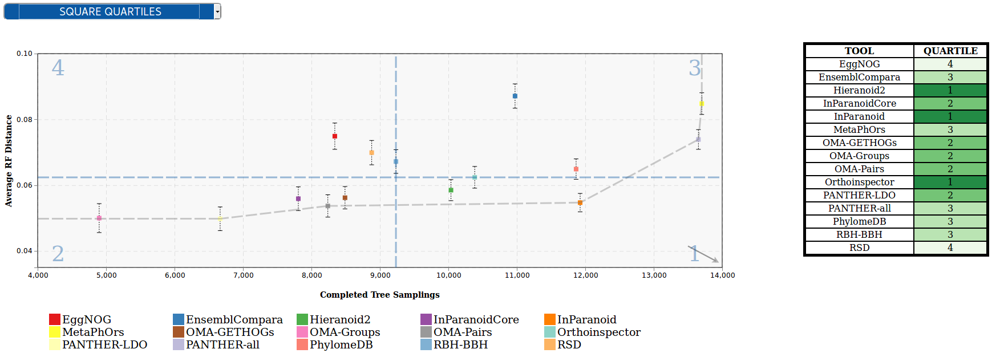
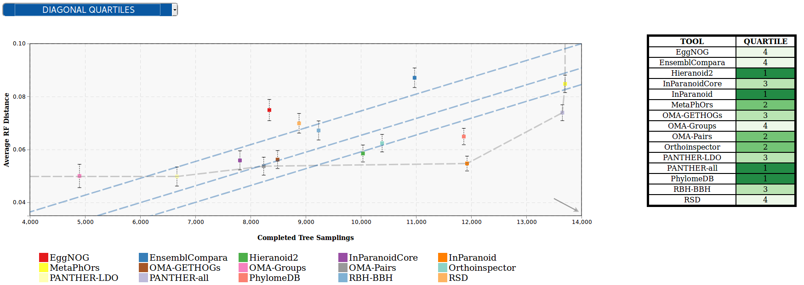
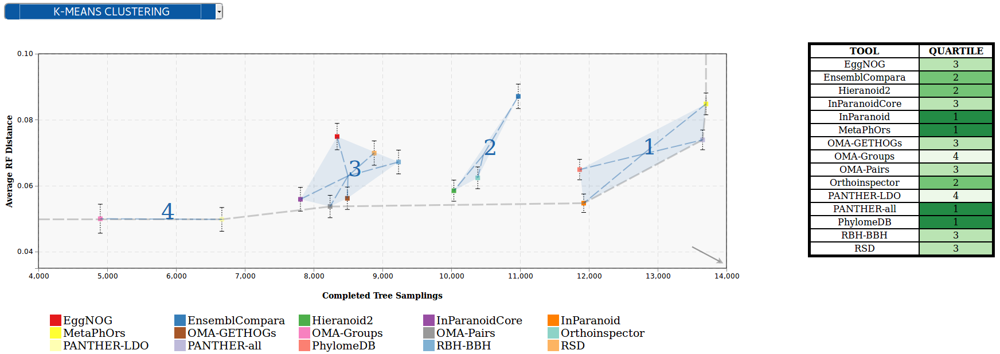

# OpenEBench Scientific Benchmarking visualizer
Repository that contains the code required to visualize results from scientific benchmarking experiments in plot format, and apply several classification methods in order to transform them to tabular format.

## Branches
* master: Python visualizer scripts 
* js: JavaScript visualizer project

## Classification methods
* Square quartiles - divide the plotting area in four squares by getting the 2nd quartile of the X and Y metrics.

* Diagonal quartiles - divide the plotting area with diagonal lines by assigning a score to each participant based in the distance to the 'optimal performance'.

* Clustering - group the participants using the K-means clustering algorithm and sort the clusters according to the performance.

## How to use

Requirements:

-npm
-http server

Clone the repo to your document root :
```
git clone https://github.com/inab/OpenEBench_scientific_visualizer.git
```

Install dependencies from package.json :
```
npm install 
```

Export node moodules :
```
export PATH="${PWD}/node_modules/.bin/:$PATH"
```
Compile with webpack and visualize sample results in your localhost :
```
./node_modules/.bin/webpack-cli src/app.js --output=build/build.js -d -w
```
Add JS cdn for D3 and jquery and the build file which you can download from build/build.js and tag it into your html. You can then call the `load_scatter_visualization()` function.  

The HTML file should look like [this](./index.html)

### Attributes that can be set on the _<div\>_ tag

-   data-id : the official OEB id of the aggregation dataset you want to visualize.
-   toTable: should be set to true/false depending whether you want to view the classification table in the right or not.
-   class: should always be *'benchmarkingChart_scatter'*


## Live Demo
See a demo of how this visualizer works [here](https://inab.github.io/OpenEBench_scientific_visualizer/)


